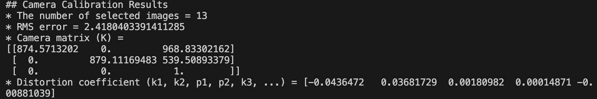

# Distortion_Calibration
A camera calibration tool based on OpenCV that estimates the camera's intrinsic parameters and lens distortion coefficients from a chessboard-pattern video, and visually compares the original and distortion-corrected images.

# 🎯 Camera_Calibration

**Camera_Calibration** is an OpenCV-based tool for estimating a camera’s intrinsic parameters and lens distortion coefficients using a video containing a chessboard pattern. It also allows visual comparison between the original and distortion-corrected images.

---

## 📸 What It Does

- Selects frames from a video where a chessboard pattern is visible  
- Detects corner points in the chessboard using `cv2.findChessboardCorners()`  
- Computes:
  - Camera intrinsic matrix `K`
  - Distortion coefficients `(k1, k2, p1, p2, k3, …)`
- Rectifies distorted frames using `cv2.initUndistortRectifyMap()`  
- Displays both original and corrected images, with toggle support

---

## 🛠 How to Use
1. Prepare a chessboard video
Put a chessboard video in the project folder (e.g., chessboard.avi)

2. Run the script
``` bash
python camera_calibration.py
```
3. Image selection
Space: Pause and detect corners

Enter: Select current frame

ESC: Finish selecting images

4. View correction result
After calibration, video will be played again

Press Tab to toggle between:

"Original" view (distorted)

"Rectified" view (corrected)

Press ESC to exit#

---

## Output
### Calibration Result


### 📷 Chessboard Frame Detected


### 🔄 Rectified Result


---

## Limitation
One limitation is that many smartphone cameras already apply built-in distortion correction, making the difference between the original and rectified images less noticeable. It may be more effective to use a camera with minimal built-in correction or to capture footage with raw lens distortion for clearer calibration results.